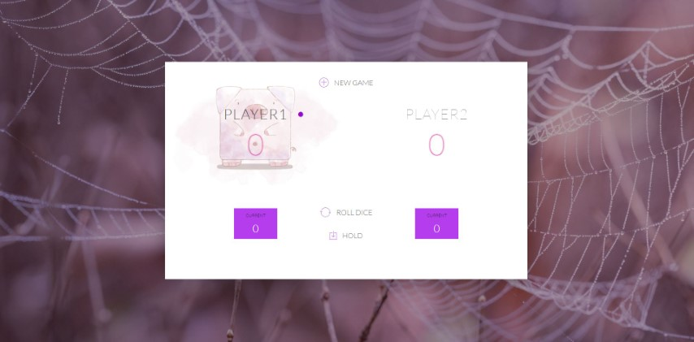

# JavaScript DOM Pig Game

## [Play now for fun](https://piggygame.netlify.app)

GAME RULES:

The game has 2 players, playing in rounds. 
In each turn, a player rolls a dice as many times as he whishes. Each result get added to his ROUND score. 
BUT, if the player rolls a 1, all his ROUND score gets lost. After that, it's the next player's turn. 
The player can choose to 'Hold', which means that his ROUND score gets added to his GLBAL score. After that,it's the next player's turn. 
The first player to reach 100 points on GLOBAL score wins the game.
